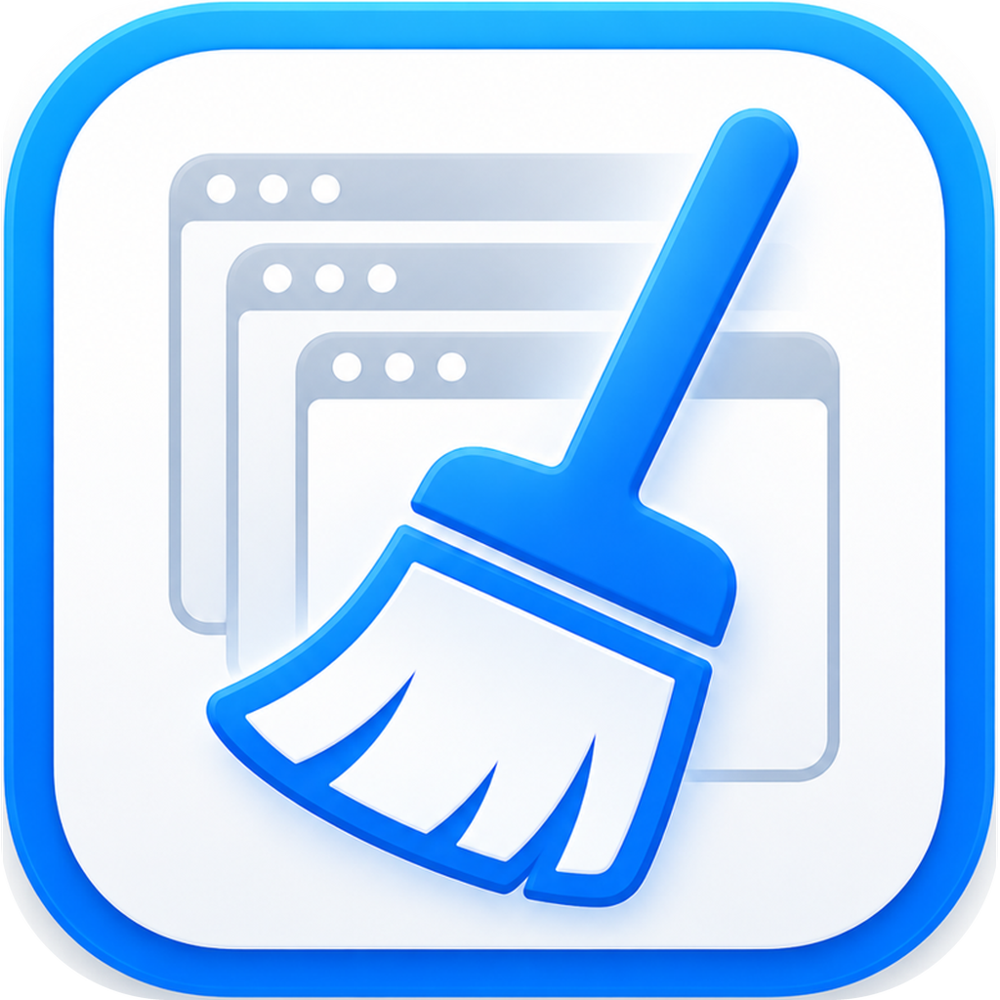

# Fresh Start

[English](README.en.md) · [下载最新版 DMG](https://github.com/huangmlj/fresh-start/releases/latest)

Fresh Start 是一个 macOS 小工具，用来在睡眠、关机或重新开始工作前，把当前桌面环境快速清理到更干净的状态。

它会列出正在运行的应用，让你选择哪些应用需要关闭，并支持一键关闭、关闭后睡眠、默认不退出名单、隐藏系统应用等功能。

  

## 免责声明

Fresh Start 会关闭正在运行的应用。使用“一键关闭”或“关闭并睡眠”之前，请先保存重要文件、上传/下载任务、终端会话、录音录像、聊天内容，以及任何不希望被中断的工作。

部分应用会弹出自己的保存确认窗口。如果某些应用不响应普通退出请求，Fresh Start 可能会对选中的顽固应用使用更强的结束方式，例如微信。未保存的内容可能会丢失。

请在理解风险后自行使用。

## 下载与安装

从 GitHub Releases 下载最新版 `.dmg`：

[下载 Fresh Start](https://github.com/huangmlj/fresh-start/releases/latest)

打开 DMG 后，把 `Fresh Start.app` 拖到 `Applications` 文件夹即可。

## 主要功能

- 以表格列出当前正在运行的 macOS 应用。
- 自由选择哪些应用加入关闭清单。
- 右键应用可设置“默认不退出”。
- 点击表头可按应用名称、状态、内存占用、PID 排序。
- 可在偏好设置中显示或隐藏系统应用。
- 一键关闭选中的应用。
- 关闭选中的应用后让 Mac 进入睡眠。
- 可切换 macOS 低电量模式，系统会弹出管理员授权。
- Fresh Start 自身也可以加入关闭清单，并会在其它应用处理完成后最后退出。

## 工作方式

Fresh Start 的默认策略是尽量保守：

- Finder 默认保留。
- 不会无差别结束系统服务。
- 主要处理用户可见应用和你明确选择的目标。
- 如果 Fresh Start 自身被选中，它会等其它应用处理完后最后退出。

## 注意事项

- 低电量模式由 `pmset` 修改，macOS 会要求管理员授权。
- 如果你取消授权弹窗，Fresh Start 会静默取消该操作，不会弹错误。
- 当前 App 是本地/ad-hoc 签名版本。根据你的 Gatekeeper 设置，第一次打开时可能需要右键选择“打开”。

## 请我喝杯咖啡

如果 Fresh Start 对你有帮助，可以扫码请我喝杯咖啡：

## 项目概览

- 平台：macOS
- 界面：SwiftUI + AppKit
- 构建：Swift Package Manager
- 分发：GitHub Releases 提供 DMG

